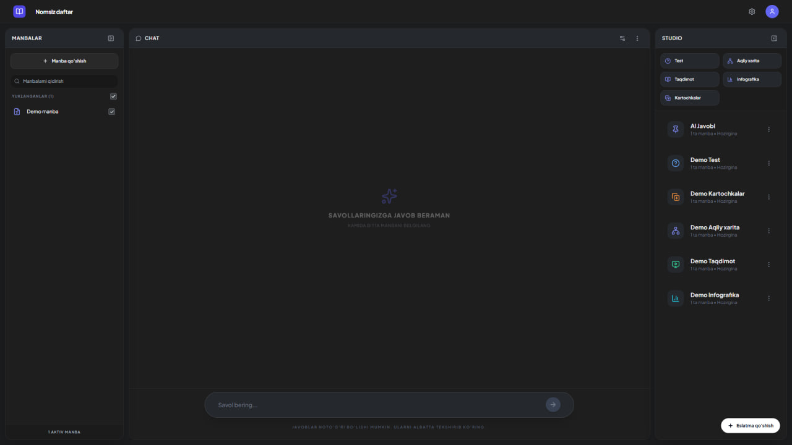

# Nomsiz Daftar

`Nomsiz Daftar` bu manbalar (matn, fayl, havola) asosida AI yordamida o‘qish va review qilish uchun web ilova.

Asosiy yo‘nalishlar:
- Chat orqali savol-javob
- Test (Quiz)
- Kartochkalar (Flashcards)
- Aqliy xarita (Mind Map)
- Taqdimot (Presentation)
- Infografika
- Eslatmalar (Notes)

---

## Nima uchun bu loyiha?

Oddiy chatdan tashqari, bitta mavzuni turli formatlarda tez tayyorlab beradi:
- bilimni tekshirish (test),
- yodlash (kartochka),
- strukturani ko‘rish (aqliy xarita),
- taqdim qilish (slides),
- vizual xulosa (infografika).

Bu, ayniqsa, o‘qish, imtihon tayyorlovi va kontent tayyorlashda qulay.

---

## Texnologiyalar

- `React 19`
- `TypeScript`
- `Vite`
- `Tailwind` (CDN orqali)
- `OpenRouter API`
- Qo‘shimcha: `react-markdown`, `remark-gfm`, `remark-math`, `rehype-katex`, `html-to-image`, `jspdf`, `lucide-react`

---

## Loyiha strukturasi

```text
src/
  App.tsx                 # Asosiy layout, global state, modal/review boshqaruvi
  index.tsx               # Entry point
  types.ts                # Umumiy turlar (types)
  components/             # UI komponentlar
  services/
    openRouterService.ts  # OpenRouter chaqiriqlari, demo logika, promptlar
index.html
vite.config.ts
tsconfig.json
.env.local
```

---

## O‘rnatish

Talab:
- `Node.js` (LTS tavsiya)

Bosqichlar:
1. Dependency o‘rnating:
   ```bash
   npm install
   ```
2. Lokal serverni ishga tushiring:
   ```bash
   npm run dev
   ```
3. Build qilish:
   ```bash
   npm run build
   ```
4. Build preview:
   ```bash
   npm run preview
   ```

---

## `.env.local` sozlamalari

Hozirgi tavsiya konfiguratsiya:

```env
# API kalitni UI dagi sozlamadan kiritasiz (localStorage)
OPENROUTER_API_KEY=

# Demo rejim
DEMO_MODE=false

# Ixtiyoriy model override'lar
OPENROUTER_MODEL=openai/gpt-4o-mini
OPENROUTER_VISION_MODEL=openai/gpt-4o-mini
OPENROUTER_IMAGE_MODEL=openai/gpt-image-1
```

Izoh:
- `.env.local` ichida kalit bo‘lishi shart emas.
- API kalitni ilova ichidagi `Sozlamalar -> OpenRouter API kalit` orqali kiritishingiz mumkin.

---

## API kalit qayerda saqlanadi?

UI orqali kiritilgan kalit:
- brauzer `localStorage` ga yoziladi (`OPENROUTER_API_KEY`).

Muhim:
- `.env.local` yoki deploy env ichida `OPENROUTER_API_KEY` bo‘lsa, u ustun kelishi mumkin.
- Faqat UI orqali boshqarmoqchi bo‘lsangiz, env dagi keyni bo‘sh qoldiring.

---

## Demo rejim

Demo rejimda:
- real API chaqiruv bo‘lmaydi,
- mock natijalar qaytadi,
- demo source/review materiallar avtomatik yaratiladi.

Yoqish usullari:
- `.env.local` da `DEMO_MODE=true`
- yoki ilova ichidan `Sozlamalar -> Demo rejim`.

---

## Asosiy imkoniyatlar

- Responsive UI: desktop / laptop / tablet / phone
- Fullscreen review oynalari (test, kartochka, taqdimot, infografika, aqliy xarita)
- CSV yuklab olish (kartochka)
- Matn/PDF/rasm/havola bilan ishlash
- Uzbek tiliga mos promptlar va demo oqim

---

## Xavfsizlik

- `.env.local` ni GitHub’ga push qilmang.
- API kalitni hech qachon public repository ga yozmang.
- Agar kalit tasodifan oshkor bo‘lsa, OpenRouter paneldan darhol yangilang (rotate).

---

## Keng tarqalgan muammolar

1. `OPENROUTER_API_KEY topilmadi`
- Sozlamadan kalit kiriting yoki `.env.local`ga qo‘ying.
- Dev serverni qayta ishga tushiring.

2. Demo ON/OFF darhol o‘zgarmadi
- Sozlamadan qayta almashtiring.
- Zarur bo‘lsa bir marta sahifani refresh qiling.

3. Build vaqtida katta chunk warning
- Bu warning; loyiha baribir build bo‘ladi.
- Istasangiz keyinroq code-splitting qo‘shish mumkin.

---

## Qisqa foydalanish flow

1. Manba qo‘shing (`Matn`, `Fayl`, `Havola`).
2. Chatdan savol bering.
3. Studio panelidan kerakli tool tanlang (`Test`, `Kartochka`, `Aqliy xarita`, `Taqdimot`, `Infografika`).
4. Natijani review qilib saqlang yoki eksport qiling.

---

## Review Screenshot



---

## Litsenziya

Ichki/loyiha ehtiyoji uchun ishlatish ko‘zda tutilgan. Kerak bo‘lsa alohida LICENSE qo‘shing.
